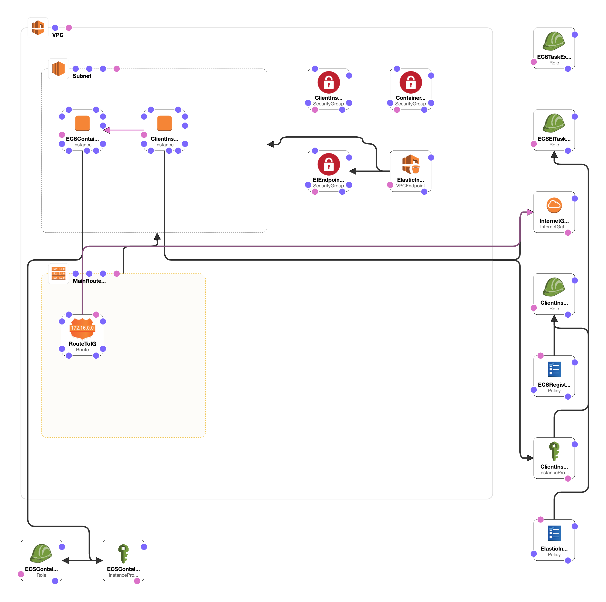
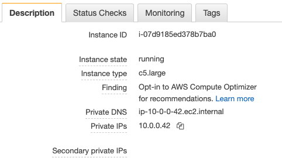

# Steps
1. Launch the CloudFormation template: [:arrow_right: Here](https://console.aws.amazon.com/cloudformation/home?region=us-east-1#/stacks/new?stackName=EIECSDemo&templateURL=https://s3.amazonaws.com/amazonei/CF-templates/ECSAmazonElasticInference.yaml)

    The Cloudformation template creates the following resources: 
    
    
    1. VPC and a Public Subnet (includes Public Route Table and IGW)
    2. Elastic Inference (EI) Endpoint and EI Endpoint Security Group. 
    3. IAM Policy Roles `ecs-ei-task-role` with `elastic-inference:Connect` 
        1. In this demo, `ecs-ei-task-role` includes additional IAM and EC2 list permissions for debugging.
    5. IAM Roles [bastion] `ClientInstanceRole`, [ec2 instance] `ECSContainerInstanceRole`, [ecs task] `ecsTaskExecutionRole`, [ecs task to EI] `ecs-ei-task-role`
    6. EC2 Instance `ECSContainerInstance` with sec group `ECSContainerInstanceSecurityGroup`
    7. EC2 Instance `ClientInstanceRole` with sec group `ClientInstanceSecGroup`
    8. IAM Instance Role for client instance `ClientInstanceProfile`
    9. SecGroups 
        1. allow 22 to [bastion]
        2. allow 443 in/out of EI Endpoint from within VPC
        3. allow 9000, 8500 to EC2 (Container Instance) from within VPC
        
    
2. Navigate to the ECS console. The Cloudformation template has also created a Task Definition named `ei-ecs-ubuntu-tfs-bridge`. 

    1. Inspect the Task Definition for 2 containers: TF ModelServer and EI-enabled TF ModelServer from Tensor Flow Serving. 
    2. Both containers are running on ubuntu Deep Learning optimized Container Images. The EI TF MS container downloads the additional EI-enabled MS binary and forces EI metadata lookup from the container instance.
    3. Inspect the containers: 
        
    
    
        * EIA container running image `tensorflow-inference-eia:1.14.0` is serving at port `9001` 
        * Non-EIA container running image `tensorflow-inference:1.14.0` is serving at `8501`. 
            
3. We will benchmark the inference calls made to the two containers.

    1. Obtain the private IP of the ECS container instance from the EC2 console. This will be your `$SERVER_IP`
        
    2. Connect to the client server via SSH - it is named as `EC/ECS blog - Client Instance` in the EC2 console. Use the IP or Public DNS with the Key Pair you have created earlier.
    
    3. In the client instance shell, test that you are able to access the ECS Container Instance. 
    
        ```bash
            [ec2-user@ip-10-0-0-183 ~]$ export SERVER_IP=<YOUR SERVER_IP here
            [ec2-user@ip-10-0-0-183 ~]$ for PORT in 8501 9001; do   curl -s http://${SERVER_IP}:${PORT}/v1/models/ssdresnet; done
        ```
        
        A successful health check should look like this: 
        
        ```bash
            {
             "model_version_status": [
              {
               "version": "1",
               "state": "AVAILABLE",
               "status": {
                "error_code": "OK",
                "error_message": ""
               }
              }
             ]
            }
            {
             "model_version_status": [
              {
               "version": "1",
               "state": "AVAILABLE",
               "status": {
                "error_code": "OK",
                "error_message": ""
               }
              }
             ]
            }
        ```
        
    4. Now, you are ready to test both containers. Run the following commands: 
    
        ```bash
            source activate amazonei_tensorflow_p27
            for PORT in 8500 9000
            do
              python ssd_resnet_client.py --server=${SERVER_IP}:${PORT} --image 3giraffes.jpg
            done
        
        ```
    
        You should see the inference outputs for both models: 
        
        ```bash
            The first inference request loads the model into the accelerator and can take several seconds to complete. Please standby!
            Inference 0 took 12.923095 seconds
            Inference 1 took 1.363095 seconds
            Inference 2 took 1.338855 seconds
            ...
            Inference 19 took 1.289530 seconds
            4 detection[s]
            SSD Prediction is (label, probability):  ['giraffe: 0.84', 'giraffe: 0.74', 'giraffe: 0.68', 'giraffe: 0.50']
            Latency:
            p95: 1.36 seconds
            p50: 1.30 seconds
            
            The first inference request loads the model into the accelerator and can take several seconds to complete. Please standby!
            Inference 0 took 14.081767 seconds
            Inference 1 took 0.295794 seconds
            ...
            Inference 19 took 0.225444 seconds
            4 detection[s]
            SSD Prediction is (label, probability):  ['giraffe: 0.84', 'giraffe: 0.74', 'giraffe: 0.68', 'giraffe: 0.50']
            Latency:
            p95: 0.31 seconds
            p50: 0.29 seconds
        
        ```
    
Compare the Latency outputs of the inference jobs using EIA `(0.29 seconds-p50)` and without `(1.30 seconds-p50)`.


# Cleanup

1. Head to the CloudFormation console and delete the Stack.

# Resources
1. Fork: https://awsfeed.com/whats-new/machine-learning/running-amazon-elastic-inference-workloads-on-amazon-ecs/
